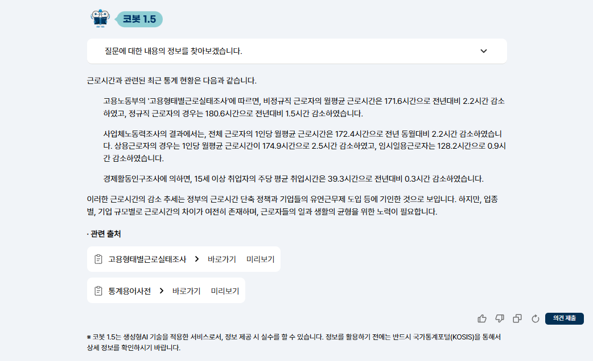
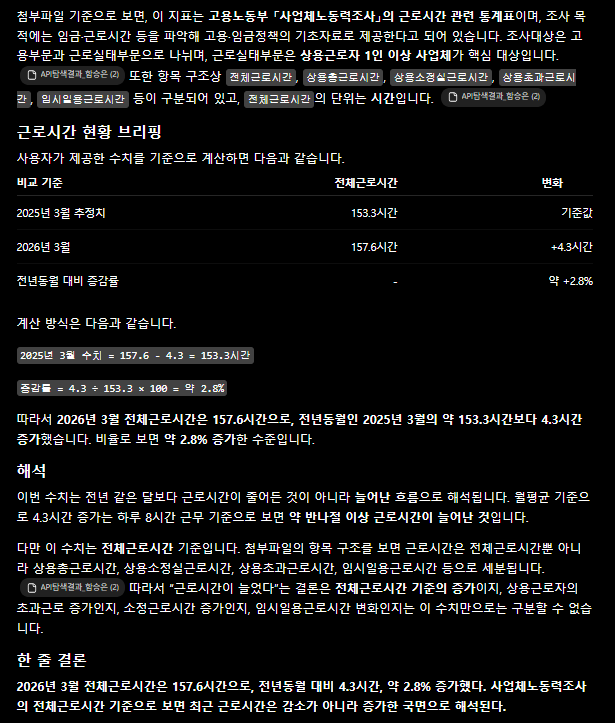

# 1. 코봇

**[프롬포트 질문]**

근로시간 수치가 구체적으로 얼마나, 어떻게 변했는지 비교해서 현황을 브리핑해 줘.

**[코봇 답변]**

근로시간과 관련된 최근 통계 현황은 다음과 같습니다.
고용노동부의 '고용형태별근로실태조사'에 따르면,
비정규직 근로자의 월평균 근로시간은 171.6시간으로 전년대비 2.2시간 감소하였고,
정규직 근로자의 경우는 180.6시간으로 전년 대비 1.5시간 감소하였습니다.

사업체노동력조사의 결과에서는,
전체 근로자의 1인당 월평균 근로시간은 172.4시간으로 전년 동월대비 2.2 시간 감소하였습니다.
상용 근로자의 경우는 1인당 월평균 근로시간이 174. 9시간으로 2.5시간 감소하였고,
임시 일용근로자는 128.8시간으로 0.9시간 감소하였습니다.

경제활동인구조사에 따르면 15세 이상 취업자의 주당 평균 취업시간은 39.3시간으로 전년대비 0.3시간 감소하였습니다.
이러한 근로시간의 감소 추세는 정부의 근로시간 단축 정책과 기업들의 유연근무제 도입 등에 기인한 것으로 보입니다.
하지만, 업종별, 기업 규모별로 근로시간의 차이가 여전히 존재하며, 근로자들의 일과 생활의 균형을 위한 노력이 필요합니다.

**[결과 해석]**

코봇 답변은 사용자가 단순히 “근로시간”이라고 물었을 때, 하나의 통계표를 기준으로 답한 것이 아니라 여러 조사와 개념을 혼합해 답변하였다.

특히 다음과 같은 문제가 확인된다.

1. **출처 혼합 문제**  
   코봇은 고용형태별근로실태조사, 사업체노동력조사, 경제활동인구조사를 한 답변 안에서 함께 사용하였다. 그러나 이 세 조사는 조사 대상, 산출 기준, 주기, 개념이 서로 다르기 때문에 동일한 “근로시간”이라는 이름만으로 직접 비교하기 어렵다.

2. **지표 기준 불명확 문제**  
   사용자는 “근로시간”이라고 질문했지만, 코봇은 전체근로시간, 정규직/비정규직 근로시간, 상용근로자 근로시간, 임시일용근로자 근로시간, 주당 평균 취업시간을 한꺼번에 제시하였다. 따라서 사용자가 어떤 통계표의 어떤 항목을 기준으로 현황을 이해해야 하는지 불명확하다.

3. **KOSIS/API 기준값 검증 부족**  
   답변에 제시된 수치가 업로드된 API 탐색 결과의 통계표, 항목, 수록기간, 단위와 일치하는지 확인하는 과정이 보이지 않는다. 경기종합지수 사례처럼 수치와 방향성이 틀릴 위험이 있으며, 평균 가구원수 사례처럼 출처가 다른 통계로 바뀌는 위험도 존재한다.

4. **원인 해석 환각 가능성**  
   “정부의 근로시간 단축 정책과 기업들의 유연근무제 도입 등에 기인”했다는 설명은 별도 근거 없이 제시되었다. 단순 수치 변화만으로 정책 효과나 기업 행태 변화를 직접 원인으로 단정하는 것은 과잉 해석이다.

따라서 1단계 코봇 답변은 **수치를 제시하긴 했지만, 통계표·항목·단위·출처가 통제되지 않은 상태에서 여러 통계를 섞어 답한 사례**로 볼 수 있다.

# 2. GPT Before

**[GPT 프롬포트 질문]**

`API탐색결과_함승은 .json` 첨부

내가 KOSIS에서 근로시간 데이터를 가져왔어.
기준 통계표는 고용노동부 사업체노동력조사의 사업체 근로시간 관련 통계표야.

2026년 3월 수치: 전체근로시간 157.6시간  
전년동월 대비 증감: +4.3시간

그리고 이 지표에 대한 통계청 또는 고용노동부의 설명, 항목 구조, 단위, 수록기간, 주의사항은 내가 첨부한 파일 안에 들어있어.
이 숫자들과 첨부파일의 설명을 바탕으로, 근로시간 수치가 구체적으로 얼마나, 어떻게 변했는지 비교해서 현황을 브리핑해 줘.

**[GPT 답변]**

첨부파일 기준으로 보면, 이 지표는 고용노동부 「사업체노동력조사」의 근로시간 관련 통계표이며, 조사 목적에는 임금·근로시간 등을 파악해 고용·임금정책의 기초자료로 제공한다고 되어 있습니다. 조사대상은 고용부문과 근로실태부문으로 나뉘며, 근로실태부문은 상용근로자 1인 이상 사업체가 핵심 대상입니다. 또한 항목 구조상 전체근로시간, 상용총근로시간, 상용소정실근로시간, 상용초과근로시간, 임시일용근로시간 등이 구분되어 있고, 전체근로시간의 단위는 시간입니다.

근로시간 현황 브리핑

사용자가 제공한 수치를 기준으로 계산하면 다음과 같습니다.

비교 기준	전체근로시간	변화
2025년 3월 추정치	153.3시간	기준값
2026년 3월	157.6시간	+4.3시간
전년동월 대비 증감률	-	약 +2.8%

계산 방식은 다음과 같습니다.

2025년 3월 수치 = 157.6 - 4.3 = 153.3시간

증감률 = 4.3 ÷ 153.3 × 100 = 약 2.8%

따라서 2026년 3월 전체근로시간은 157.6시간으로, 전년동월인 2025년 3월의 약 153.3시간보다 4.3시간 증가했습니다. 비율로 보면 약 2.8% 증가한 수준입니다.

해석

이번 수치는 전년 같은 달보다 근로시간이 줄어든 것이 아니라 늘어난 흐름으로 해석됩니다. 월평균 기준으로 4.3시간 증가는 하루 8시간 근무 기준으로 보면 약 반나절 이상 근로시간이 늘어난 것입니다.

다만 이 수치는 전체근로시간 기준입니다. 첨부파일의 항목 구조를 보면 근로시간은 전체근로시간뿐 아니라 상용총근로시간, 상용소정실근로시간, 상용초과근로시간, 임시일용근로시간 등으로 세분됩니다. 따라서 “근로시간이 늘었다”는 결론은 전체근로시간 기준의 증가이지, 상용근로자의 초과근로 증가인지, 소정근로시간 증가인지, 임시일용근로시간 변화인지는 이 수치만으로는 구분할 수 없습니다.

한 줄 결론

2026년 3월 전체근로시간은 157.6시간으로, 전년동월 대비 4.3시간, 약 2.8% 증가했다. 사업체노동력조사의 전체근로시간 기준으로 보면 최근 근로시간은 감소가 아니라 증가한 국면으로 해석된다.

**[결과 해석]**

GPT Before 답변은 코봇에 비해 통계표 기준을 더 명확하게 통제했다는 점에서 개선된 결과를 보인다. 사용자가 기준 통계표를 “고용노동부 사업체노동력조사의 사업체 근로시간 관련 통계표”로 지정했고, 항목도 “전체근로시간”으로 한정했기 때문에 코봇처럼 여러 조사와 근로시간 개념을 섞어 답변하는 문제는 줄어들었다.

특히 GPT는 첨부파일의 메타자료를 활용하여 해당 지표가 고용노동부 「사업체노동력조사」 기반이라는 점, 근로시간 항목이 전체근로시간·상용총근로시간·상용소정실근로시간·상용초과근로시간·임시일용근로시간 등으로 세분된다는 점, 전체근로시간의 단위가 “시간”이라는 점을 반영하였다. 또한 사용자가 제시한 2026년 3월 전체근로시간 157.6시간과 전년동월 대비 +4.3시간을 바탕으로 2025년 3월 값을 153.3시간으로 역산하고, 증감률을 약 +2.8%로 계산하였다.

그러나 이 결과는 AI가 스스로 원자료에서 정확한 시계열 값을 찾아 검증했다기보다는, 사용자가 이미 제공한 수치와 증감값을 바탕으로 산술 계산을 수행한 것에 가깝다. 즉, 답변의 정확성은 통계 메타데이터 이해력보다는 사용자가 제공한 숫자의 정확성에 크게 의존한다.

또한 첨부파일의 주의사항이 dataUserNote: "첨부파일 확인"처럼 구체적으로 구조화되어 있지 않은 상태이기 때문에, GPT가 실제로 어떤 위험 조건을 확인했는지 불명확하다. 예를 들어 수록기간이 실제로 2026년 3월까지 포함되는지, 해당 수치가 파일 안의 통계표 범위와 일치하는지, 최신 월 자료가 잠정치인지, 산업분류와 규모별 기준이 “전체/전규모”로 통일되어 있는지 등을 명시적으로 검증하지 않았다.

따라서 Before 단계의 핵심 한계는 다음과 같다.

사용자 제공 수치 의존
GPT는 157.6시간과 +4.3시간을 그대로 신뢰하고 계산하였다. 사용자가 잘못된 수치를 입력하면 그 오류를 그대로 바탕으로 그럴듯한 브리핑을 생성할 수 있다.
수록기간 검증 부족
첨부파일에서 통계표 ID와 항목 구조는 확인했지만, 2026년 3월 수치가 실제 수록기간 안에 존재하는지까지는 명확히 검증하지 않았다.
주의사항 반응 미흡
원본 API 탐색 결과의 주의사항은 구조화된 경고 태그가 아니라 산문 또는 불완전한 형태로 들어 있어, GPT가 이를 행동 제약 신호로 사용하지 못했다.
계산 가능 여부 판단 부재
답변은 바로 역산과 증감률 계산을 수행했다. 즉, “이 지표는 직접 계산해도 되는가?”를 먼저 판단하는 절차가 부족하다.
부분적 안전성 확보
다만 코봇과 달리 GPT는 “전체근로시간 기준의 증가”라고 한정하고, 상용근로자의 초과근로 증가인지 소정근로시간 증가인지는 알 수 없다고 제한적으로 해석했다. 이 점은 과도한 원인 해석을 줄였다는 점에서 개선된 부분이다.

결론적으로 GPT Before는 코봇보다 출처와 항목을 더 잘 통제했지만, 여전히 사용자가 준 숫자를 신뢰해 계산을 진행하는 구조이다. 따라서 통계 메타데이터가 경고 신호로 구조화되어 있지 않으면, AI는 수록기간·주의사항·잠정치·분류 기준을 선제적으로 점검하지 못하고 계산 중심의 답변을 생성할 가능성이 있다.

# 3. GPT After

**[GPT 프롬포트 질문]**

태그변환완료_함승은.json 첨부

너는 국가데이터처의 신뢰할 수 있는 통계 챗봇이야.

사용자가 데이터를 주고 비교를 요구하더라도, 대답을 시작하기 전에 반드시 내가 첨부한 [통계 메타데이터 사전] 파일을 스캔해.

먼저 사용자가 질문한 지표가 어떤 통계표, 어떤 항목, 어떤 단위, 어떤 분류 기준에 해당하는지 확인해.

그다음 해당 지표에 warning_tags가 있는지 확인해.

만약 질문한 지표에 🚫, 🚨, ⚠️, 📐 등의 고위험 경고 태그가 존재한다면, 사용자가 원하더라도 절대 과거 데이터와의 직접적인 수치 연산, 증감률 계산, 전년동월 대비 비교, % 계산을 시도하지 마.
대신 파일에 적힌 evidence를 근거로 왜 직접 비교 계산이 위험한지 설명하고, 안전한 대안을 제안해.

반대로 고위험 경고 태그가 없고, 단위·항목·수록기간·분류 기준이 일치한다면 계산을 수행해도 돼.
다만 계산 전에는 반드시 다음을 확인해.

기준 통계표가 고용노동부 「사업체노동력조사」의 근로시간 관련 통계표인지
사용자가 제시한 항목이 전체근로시간인지
단위가 시간인지
비교 기준이 전년동월 비교인지
산업분류와 규모별 기준이 동일한지
수록기간 또는 최신성 문제로 인해 비교가 제한되는지

**[GPT 답변]**

첨부된 [통계 메타데이터 사전]을 먼저 확인했습니다. 근로시간 지표는 다음 기준으로 정리됩니다.

확인 항목	내용
지표명	근로시간
기준 통계	고용노동부 「사업체노동력조사」
통계표 ID	DT_118N_MON051
항목	전체근로시간
단위	시간
분류 기준	산업분류, 규모별
공표 주기	월
공표 시점	조사기준 월 익월
warning_tags 확인

첨부파일에서 근로시간 지표에는 다음 warning_tags가 확인됩니다.

태그	의미	처리 방식
🧩 항목혼합주의	전체근로시간, 상용총근로시간, 상용소정실근로시간, 상용초과근로시간, 임시일용근로시간이 구분됨	반드시 항목 기준 명시
📐 단위주의	같은 통계표 안에 일·시간·원 단위가 함께 존재	시간 단위 항목만 사용
🏷️ 분류기준주의	산업분류와 규모별 기준이 존재	동일 분류 기준일 때만 비교
⚠️ 주의필요	세부 주의사항 전문이 구조화되어 있지 않음	제한적으로 해석
📅 최신성주의	월별 공표, 조사기준 월 익월 공표	최신월·수록기간 확인 필요

따라서 이 지표는 무조건 계산 금지 대상은 아니지만, 전체근로시간, 시간, 동일한 산업분류·규모별 기준이라는 전제가 맞을 때만 조건부 계산이 가능합니다.

근로시간 현황 브리핑

사용자가 제시한 값은 다음과 같습니다.

기준	수치
2026년 3월 전체근로시간	157.6시간
전년동월 대비 증감	+4.3시간

전년동월 대비 +4.3시간이므로, 2025년 3월 수치는 다음과 같이 역산됩니다.

2025년 3월 전체근로시간 = 157.6시간 - 4.3시간 = 153.3시간

증감률은 다음과 같습니다.

증감률 = 4.3 ÷ 153.3 × 100 = 약 2.8%
비교 기준	전체근로시간	변화
2025년 3월	153.3시간	기준값
2026년 3월	157.6시간	+4.3시간
전년동월 대비 증감률	-	약 +2.8%
해석

2026년 3월 전체근로시간은 157.6시간으로, 전년동월인 2025년 3월의 153.3시간보다 4.3시간 증가했습니다. 증가율로는 약 2.8% 증가입니다.

다만 이 해석은 반드시 사업체노동력조사 DT_118N_MON051의 전체근로시간, 단위 시간 기준으로 한정해야 합니다. 첨부파일상 근로시간 항목은 전체근로시간 외에도 상용총근로시간, 상용소정실근로시간, 상용초과근로시간, 임시일용근로시간으로 나뉘므로, 이 결과를 “상용근로자의 초과근로 증가”나 “임시일용근로자의 근로시간 증가”로 바로 해석하면 안 됩니다.

또한 파일의 action rule에 따르면 산업분류와 규모별 기준이 동일한지 확인해야 하므로, 이 비교는 동일 산업분류·동일 규모별 기준이라는 전제에서만 유효합니다.

한 줄 결론

2026년 3월 전체근로시간은 157.6시간으로, 전년동월보다 4.3시간, 약 2.8% 증가했다. 다만 이는 고용노동부 사업체노동력조사의 전체근로시간 기준이며, 항목·단위·산업분류·규모별 기준이 동일하다는 전제에서만 비교 가능하다.

.png)
.png)

**[결과 해석]**

GPT After 답변은 Before 단계와 동일한 수치와 동일한 비교 요청을 받았지만, 답변을 시작하기 전에 첨부된 `태그변환완료_함승은.json`의 메타데이터 사전을 먼저 확인했다는 점에서 차이가 있다. 특히 단순히 사용자가 준 수치를 바로 계산한 것이 아니라, 기준 통계표·항목·단위·분류 기준·warning_tags를 먼저 점검한 뒤 조건부로 계산을 수행하였다.

After 답변은 먼저 근로시간 지표가 고용노동부 「사업체노동력조사」의 `DT_118N_MON051` 통계표에 해당하며, 사용자가 제시한 항목이 `전체근로시간`, 단위가 `시간`, 분류 기준이 `산업분류`와 `규모별`이라는 점을 확인하였다. 이는 코봇처럼 여러 조사를 혼합하거나, Before처럼 사용자가 준 수치를 곧바로 계산하는 방식보다 더 안전한 절차이다.

또한 첨부파일의 warning_tags를 확인하여 `🧩 항목혼합주의`, `📐 단위주의`, `🏷️ 분류기준주의`, `⚠️ 주의필요`, `📅 최신성주의`가 존재함을 반영하였다. 이 태그들은 근로시간 지표가 전체근로시간, 상용총근로시간, 상용소정실근로시간, 상용초과근로시간, 임시일용근로시간 등으로 세분되어 있고, 같은 통계표 안에 일·시간·원 단위가 함께 존재하며, 산업분류와 규모별 기준이 포함되어 있음을 알려준다. 따라서 AI가 계산 전에 어떤 항목과 단위를 사용해야 하는지, 어떤 분류 기준이 동일해야 하는지 확인하도록 작동하였다.

다만 After 답변은 warning_tags가 존재한다고 해서 무조건 계산을 거절하지 않았다. 태그변환 파일의 calculation_policy에서 계산 가능 조건이 설정되어 있었기 때문에, `전체근로시간`, `시간 단위`, 동일한 산업분류·규모별 기준이라는 전제가 충족된 경우에 한해 전년동월 대비 증감과 증감률 계산을 수행하였다. 이 점은 경기종합지수처럼 고위험 태그가 있어 계산을 차단해야 하는 사례와 구분된다.

계산 결과 자체는 Before와 동일하게 2026년 3월 전체근로시간 157.6시간에서 전년동월 대비 +4.3시간을 이용해 2025년 3월 값을 153.3시간으로 역산하고, 증감률을 약 +2.8%로 제시하였다. 하지만 중요한 차이는 계산값이 아니라 계산에 이르기까지의 절차이다. Before는 사용자가 준 숫자를 신뢰하고 바로 계산한 반면, After는 메타데이터 사전의 태그를 확인한 뒤 “조건이 일치할 때만 계산 가능하다”는 제한을 명시하였다.

특히 After 답변은 계산 결과를 해석할 때도 “사업체노동력조사 `DT_118N_MON051`의 전체근로시간, 단위 시간 기준”으로 한정하였다. 또한 이 결과를 상용근로자의 초과근로 증가나 임시일용근로자의 근로시간 증가로 확대 해석하면 안 된다고 명시하였다. 이는 항목혼합주의 태그가 실제 답변 행동에 반영된 사례이다.

또한 산업분류와 규모별 기준이 동일해야 비교가 유효하다고 설명함으로써, 분류기준주의 태그도 답변에 반영되었다. 즉 After 단계에서는 AI가 단순히 수치를 계산하는 데 그치지 않고, 계산이 성립하기 위한 조건을 함께 제시하였다.

따라서 GPT After의 핵심 개선점은 다음과 같다.

1. **메타데이터 선검토**
   답변 전에 통계표 ID, 항목명, 단위, 분류 기준을 먼저 확인하였다.

2. **warning_tags 반영**
   항목혼합주의, 단위주의, 분류기준주의, 최신성주의 등을 확인하고 답변 조건에 반영하였다.

3. **조건부 계산 수행**
   고위험 비교금지 태그가 없고, 항목·단위·분류 기준이 일치한다는 전제에서만 계산하였다.

4. **해석 범위 제한**
   “전체근로시간 기준 증가”로만 해석하고, 초과근로 증가나 특정 고용형태의 변화로 확대 해석하지 않았다.

5. **AI 행동 통제 가능성 확인**
   태그변환 파일이 단순 참고자료가 아니라, AI가 계산 가능 여부를 판단하고 답변 범위를 제한하는 행동 지침으로 작동하였다.

결론적으로 GPT After는 Before와 같은 수치 결과를 산출했지만, 그 의미는 다르다. Before는 사용자가 준 수치를 바탕으로 산술 계산을 수행한 사례이고, After는 구조화된 메타데이터와 warning_tags를 근거로 계산 가능 여부를 먼저 판단한 뒤 제한적으로 계산한 사례이다. 따라서 After 방식은 통계표·항목·단위·분류 기준이 혼동될 수 있는 지표에서 AI 환각과 과잉 해석을 줄이는 데 효과적인 방식으로 볼 수 있다.
