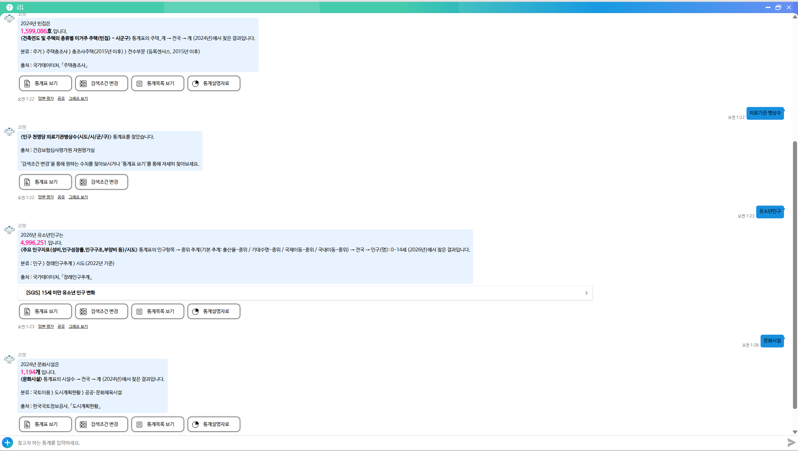
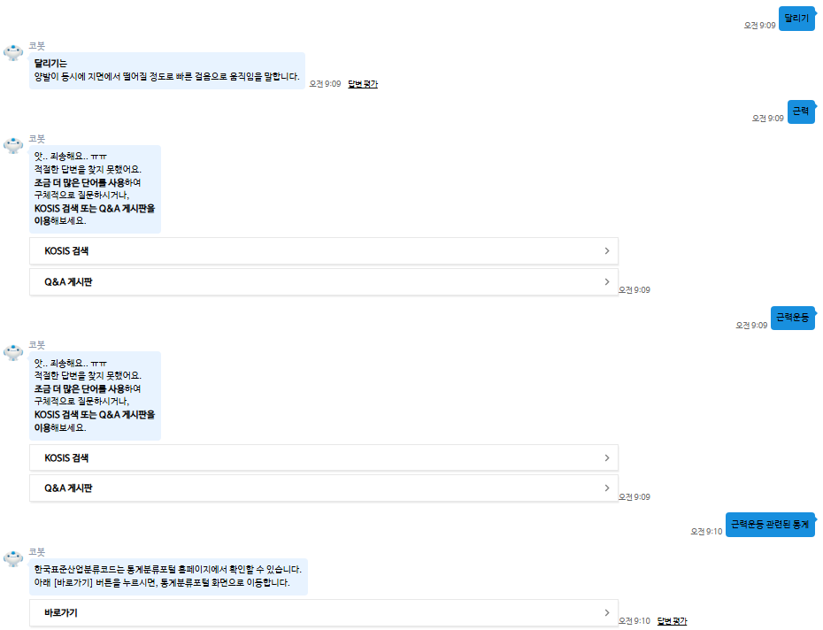
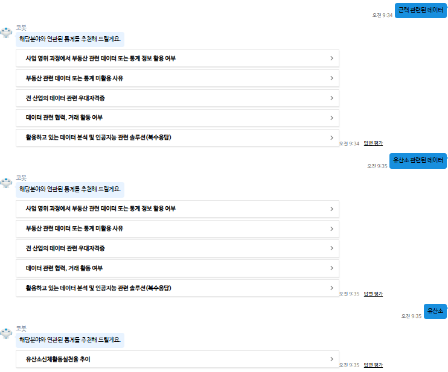
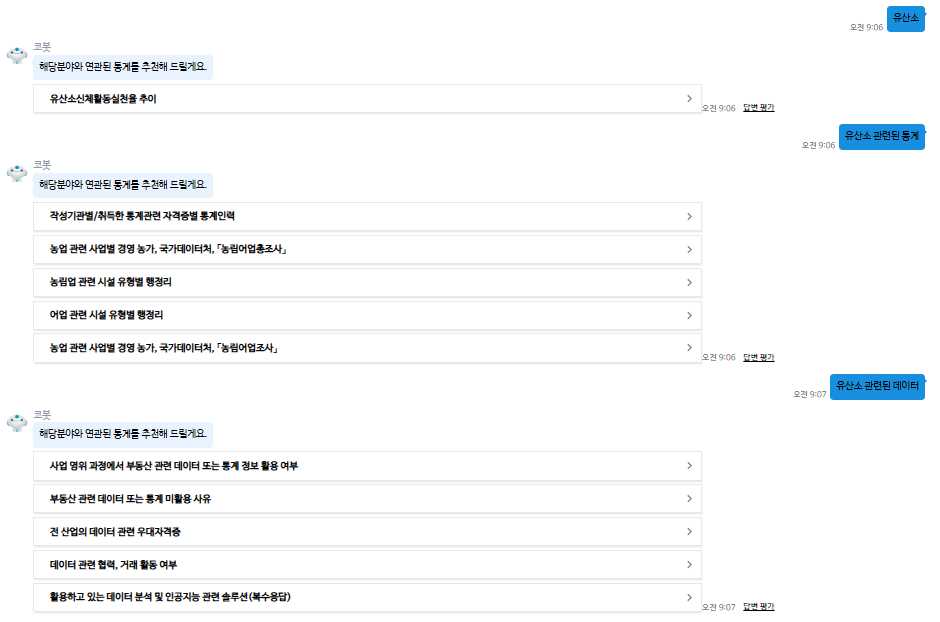
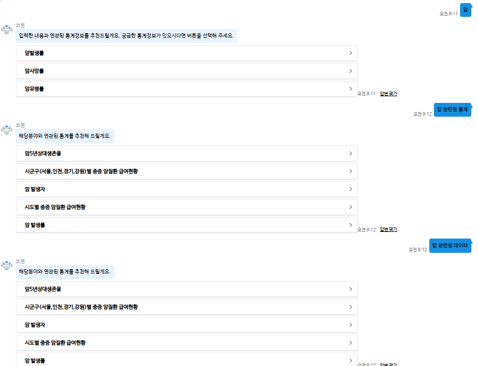

1. 통계 단어만 입력했을 때 단어별 현황수치 제공 / 미제공 차이

- 빈집, 유소년인구, 문화시설, 의료기관병상수 검색
-> 의료기관병상수는 통계표가 있음에도 젤 최근 수치 언급 없음 
-> 통일화 필요해보임

(출처가 국가데이터처가 아니어도 일부는 현황 수치는 제공해줌)

2. 단어별로 개념 제시/ 미제시 갈림

->어떤 단어에 대해서는 데이터를 보여주진 않아도 개념설명 해줌
->어떤 단어는 데이터 X, 개념 X, 적절한 답변을 찾지 못함
ex. kosis에서 "근력"을 치면 관련된 통계표가 나오긴 함, 코봇에서 개념을 제시해주는 기준이 있는지 궁금

3. "[단어] 관련된 데이터" 오류

-> [단어]와 관련이 없는 데이터나 통계표를 추천해주는 경우가 있음

4. "[단어]" vs "[단어] 관련된 데이터" vs "[단어] 관련된 통계" 답변 차이

-> "[단어]"만 입력했을때는 후자의 질문 2개보다 대부분 다른값이 나옴 (4-2)
-> "[단어] 관련된 데이터" / "[단어] 관련된 통계" 이 두개의 질문은 답이 다르게 나오는 [단어]도 있음(4-1)
