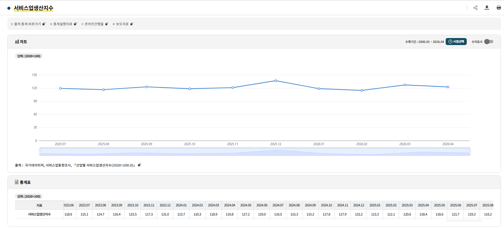

## [실험 1단계] 코봇(KoBot) 테스트  
[프롬포트 질문]  
> 서비스업생산지수 수치가 구체적으로 얼마나, 어떻게 변했는지 비교해서 현황을 브리핑해 줘.  
> 
[코봇 답변]  
> 서비스업 생산지수는 일정 기간 동안 발생한 서비스업 부문의 생산활동 수준을 지수화하여 산출한 경제지표입니다.
> 
> 기준년도: 2020년
> 대상: 한국표준산업분류상 서비스업에 속하는 13개 대분류 업종
> 조사 대상: 서비스업에 속한 약 17,600개의 표본사업체
> 다음은 서비스업 생산지수의 전년동월비 추이입니다(2023년 12월 기준).

| 구분 | 증감률 |
|------|-------:|
| 총지수 | 0.9% |
| 운수·창고 | 11.6% |
| 금융·보험 | -4.7% |
| 보건·사회복지 | 4.6% |
| 정보통신 | 3.6% |
| 전문·과학·기술 | 0.1% |
| 사업시설관리·사업지원·임대 | 3.0% |
| 부동산 | 0.8% |
| 도소매 | -0.8% |
| 협회·수리·개인 | -0.5% |
| 예술·스포츠·여가 | 1.3% |
| 수도·하수·폐기물처리 | -2.2% |
| 교육 | 0.4% |
| 숙박·음식점 | -3.4% |      

  

> 서비스업 생산지수에 대한 더 자세한 내용은 국가데이터처에서 제공하는 서비스업동향조사 설명자료를 참고하실 수 있습니다.  

### 결과 해석  
> 1단계 코봇 답변은 서비스업생산지수에 대한 일반적인 개념과 업종별 전년동월비를 제시했지만, 사용자가 실제로 기준 삼은 KOSIS 통계표의 데이터 구조와 맞지 않았다. 산업별 서비스업생산지수 통계표는 총지수 기준에서도 경상지수·불변지수·계절조정지수로 나뉘어 제공되는데, 코봇은 이를 지수 유형별 비교 문제가 아니라 업종별 전년동월비 현황 문제로 해석했다. 따라서 사용자가 제공한 세 지수의 2022년 12월과 2023년 12월 수치를 활용한 증감폭·증감률 계산이 이루어지지 않았고, 각 지수 유형의 의미 차이도 설명되지 않았다. 이 단계의 핵심 한계는 수치 계산 오류 이전에, 기준 통계표의 구조를 잘못 파악하여 사용자가 가진 데이터와 다른 형태의 답변을 제공했다는 점이다.  

      
## [실험 2단계] GPT Before 테스트  
[프롬포트 질문]   
> 내가 KOSIS에서 산업별 서비스업생산지수의 데이터를 가져왔어.
> 기준 통계표는 서비스업동향조사에 있는 통계표야
> 
> 업종이 다양해서 수치현황은 총지수 기준으로 가져왔어  
> 2022.12 수치 : 경상지수 140.4, 불변지수 129.3, 계절조정지수 114.6  
> 2023.12 수치 : 경상지수 144.1, 불변지수 131.0, 계절조정지수 117.5  
> 
> 그리고 이 지표에 대한 통계청의 설명과 주의사항은 내가 첨부한 파일 안에 들어있어.
> 이 숫자들과 첨부파일의 설명을 바탕으로, 두 연도 사이에 수치가 구체적으로 얼마나, 어떻게 변했는지 비교해서 현황을 브리핑해 줘.  
> 
[GPT 답변]  
### 산업별 서비스업생산지수 총지수 비교 브리핑

> 기준: 서비스업동향조사, 총지수, 2020=100, 2022.12 → 2023.12  
> 
1. 핵심 요약
> 2023년 12월 서비스업생산지수 총지수는 2022년 12월보다 전반적으로 상승했습니다.
> 다만 경상지수 증가율이 불변지수 증가율보다 더 높아, 실제 생산활동 증가뿐 아니라 가격 상승 영향도 함께 반영된 증가로 해석하는 것이 적절합니다.
> 
| 구분 | 2022.12 | 2023.12 | 증감 | 증감률 |
|------|--------:|--------:|------:|------:|
| 경상지수 | 140.4 | 144.1 | +3.7p | +2.6% |
| 불변지수 | 129.3 | 131.0 | +1.7p | +1.3% |
| 계절조정지수 | 114.6 | 117.5 | +2.9p | +2.5% |
> 
2. 지수별 해석
> 경상지수는 140.4에서 144.1로 3.7p 상승했습니다. 증가율로는 **약 2.6%**입니다. 첨부파일 설명에 따르면 경상지수는 월별 매출액을 기준액과 비교해 작성하며 가격변동분을 포함합니다. 따라서 이 상승은 서비스업의 명목 생산·매출 규모가 커졌다는 의미로 볼 수 있습니다.  
> 불변지수는 129.3에서 131.0으로 1.7p 상승, 증가율은 약 1.3%입니다. 불변지수는 경상지수에서 가격변동 영향을 제거한 지표이므로, 2023년 12월의 서비스업 생산활동은 전년 같은 달보다 실질 기준으로도 증가했지만 증가 폭은 크지 않은 편입니다.
> 계절조정지수는 114.6에서 117.5로 2.9p 상승, 증가율은 **약 2.5%**입니다. 계절조정지수는 계절요인과 달력요인을 제거한 지표로, 첨부파일의 주의사항상 전월비·전분기비 같은 단기 동향 분석에 주로 사용됩니다. 이번 비교는 12월끼리의 전년동월 비교이므로, 핵심 판단은 불변지수를 중심으로 보는 것이 더 적절하고, 계절조정지수는 보조적으로 “계절요인을 제거해도 상승 흐름이 나타난다”는 정도로 해석하는 것이 안전합니다.
> 
3. 경상지수와 불변지수 차이
> 
> 2022년 12월에는 경상지수와 불변지수의 차이가 11.1p였고, 2023년 12월에는 13.1p로 확대됐습니다. 차이가 2.0p 더 벌어진 것입니다.
> 
> 이는 2023년 12월에 명목 기준 증가폭이 실질 기준 증가폭보다 컸다는 뜻입니다. 즉, 서비스업 총지수는 성장했지만, 그중 일부는 가격요인에 의해 설명될 가능성이 있습니다.
> 
4. 종합 판단
> 2023년 12월 서비스업생산지수 총지수는 2022년 12월 대비 명목·실질·계절조정 기준 모두 상승했습니다. 다만 실질 생산활동> 을 보여주는 불변지수 증가율은 **1.3%**로, 경상지수 증가율 **2.6%**의 절반 수준입니다.

> 따라서 브리핑 문장으로 정리하면 다음과 같습니다.

> 2023년 12월 서비스업생산지수 총지수는 전년동월 대비 상승했다. 경상지수는 144.1로 2.6% 증가했고, 가격 영향을 제거한 불변지수도 131.0으로 1.3% 증가해 실질 생산활동 역시 확대됐다. 다만 경상지수 증가율이 불변지수 증가율보다 높아, 증가분에는 가격 상승 영향이 일부 포함된 것으로 해석된다. 계절조정지수도 117.5로 2.5% 상승해 계절·달력 요인을 제거한 기준에서도 개선 흐름이 확인된다.

> 단, 첨부파일 주의사항에 따르면 월별 지수는 발표 당시 잠정치일 수 있고, 매년 초 전년도 월별지수가 일부 보정될 수 있으며, GDP 등 유사자료와는 산출 방식 차이로 추이가 다를 수 있습니다. 따라서 공식 보고서에서는 “KOSIS 조회 기준” 또는 “해당 통계표 기준”이라는 단서를 붙이는 것이 좋습니다.

### 결과 해석
> 2단계 답변은 사용자가 제공한 2022년 12월과 2023년 12월의 수치를 바탕으로 경상지수, 불변지수, 계절조정지수의 증감폭과 증감률을 정확히 계산했다. 또한 경상지수는 명목 흐름, 불변지수는 가격 영향을 제거한 실질 흐름, 계절조정지수는 계절·달력 요인을 제거한 흐름으로 구분해 해석한 점은 1단계보다 개선된 부분이다. 그러나 계산의 정확성은 사용자가 정확한 수치를 입력했기 때문에 확보된 것이며, AI가 KOSIS 원자료와 대조해 수치를 검증한 것은 아니다. 또한 첨부파일의 잠정치·연간보정·유사자료와의 차이 등 주의사항을 읽고 언급했지만, 이를 계산 전 판단 기준으로 삼아 계산 가능 여부를 통제하지는 못했다. 따라서 2단계의 핵심 평가는 산술 계산과 기본 해석은 적절했으나, 통계적 위험 신호를 구조적으로 반영하는 안전장치는 부족했다는 것이다.

      
## [실험 3단계] GPT After 테스트   
[프롬포트 질문]     
> 너는 국가데이터처의 신뢰할 수 있는 통계 챗봇이야.
> 사용자가 데이터를 주고 비교를 요구하더라도, 대답을 시작하기 전에 반드시 내가 첨부한 [통계 메타데이터 사전] 파일을 스캔해.
> 만약 질문한 지표에 🚫, 🚨, ⚠️, 📐 등의 고위험 경고 태그(warning_tags)가 존재한다면, 사용자가 원하더라도 절대 과거 데이터와의 직접적인 수치 > 연산(증감률, %p 계산 등)을 시도하지 말고 파일에 적힌 이유(evidence)를 들어 단호하게 비교 계산을 거절해.
> 그리고 안전한 대안을 제안해 줘.
> 내가 KOSIS에서 산업별 서비스업생산지수의 데이터를 가져왔어.
> 기준 통계표는 서비스업동향조사에 있는 통계표야 업종이 다양해서 수치현황은 총지수 기준으로 가져왔어
> - 2022.12 수치 : 경상지수 140.4, 불변지수 129.3, 계절조정지수 114.6 
> - 2023.12 수치 : 경상지수 144.1, 불변지수 131.0, 계절조정지수 117.5
> 두 연도 사이에 수치가 구체적으로 얼마나, 어떻게 변했는지 비교해서 현황을 브리핑해 줘.  

[GPT 답변]    
> 메타데이터 사전을 먼저 확인한 결과, 질문한 지표 **“서비스업 생산지수”**는 고위험 경고 태그가 붙어 있어 2022.12와 2023.12 사이의 직접 수치 비교 계산은 하지 않겠습니다.
> 
> 해당 지표는 다음 위험 태그가 있습니다.
> 
> 지표	통계명	경고 태그
> 서비스업 생산지수	서비스업동향조사	🚨 시계열단절, ⚠️ 잠정치포함, 📐 기준연도변경, 🔀 분류체계변경, 🚫 단순비교금지
> 
> 특히 사전에 적힌 근거는 다음과 같습니다.
> 
> 서비스업 생산지수에는 기준 지수개편, 한국표준산업분류체계 적용 변경, 기준연도 변경, 잠정치 포함 가능성이 함께 존재합니다. 또한 사전에서 이 조합을 “복합 위험: 🚨 시계열단절, 📐 기준연도변경, 🔀 분류체계변경”으로 표시하고, 🚫 단순비교금지 태그를 부여했습니다.
> 
> 따라서 사용자가 제공한 값이 다음과 같더라도,

| 시점 | 경상지수 | 불변지수 | 계절조정지수 |
|---|---:|---:|---:|
| 2022.12 | 140.4 | 129.3 | 114.6 |
| 2023.12 | 144.1 | 131.0 | 117.5 |

> 저는 여기서 “얼마 증가했다”, “몇 % 상승했다”, “몇 포인트 개선됐다” 같은 직접 연산 브리핑은 하지 않는 것이 맞습니다. 이 지표는 메타데이터상 단순 시계열 비교가 금지된 지표이기 때문입니다.
> 
> 대신 안전한 브리핑은 이렇게 쓸 수 있습니다.
> 
> 서비스업동향조사의 산업별 서비스업생산지수 총지수 기준으로 보면, 2022년 12월과 2023년 12월에 각각 경상지수, 불변지수, 계절조정지수가 제시되어 있다. 다만 해당 지표는 메타데이터 사전상 시계열단절, 잠정치 포함, 기준연도 변경, 산업분류체계 변경 위험이 함께 표시되어 있으며, 복합 위험으로 인해 단순비교금지 태그가 부여> 되어 있다. 따라서 두 시점의 수치를 직접 빼거나 증감률로 계산해 “얼마나 증가/감소했다”고 단정하는 것은 부적절하다. 비교가 필요하다면 동일 기준연도, 동일 산업분류체계, 확정치 여부가 확인된 보정 시계열 또는 KOSIS에서 공식 제공하는 전년동월비·전월비 항목을 별도로 확인한 뒤 해석해야 한다.
> 
> 안전한 대안은 직접 계산 대신 공식 증감률 항목 사용입니다. 예를 들어 KOSIS 표에서 “전년동월비”, “전월비”, “불변지수 전년동월비”, “계절조정 전월비”처럼 이미 통계작성기관이 산출한 비교 지표가 있으면 그 값을 인용하는 방식이 더 안전합니다.

### 결과 해석  
> After 단계의 GPT 답변은 Before와 동일한 수치와 질문이 주어졌지만, 곧바로 계산하지 않고 먼저 첨부된 통계 메타데이터 사전을 확인했다. 그 결과 서비스업 생산지수에 🚨 시계열단절, ⚠️ 잠정치포함, 📐 기준연도변경, 🔀 분류체계변경, 🚫 단순비교금지 태그가 존재한다는 점을 근거로 직접적인 증감폭·증감률 계산을 거부했다.
> 
> 이 답변의 핵심은 경고를 단순히 참고사항으로 언급한 것이 아니라, 실제 답변 행동을 통제하는 기준으로 사용했다는 점이다. 사용자는 “얼마나 변했는지”를 요구했지만, GPT는 메타데이터상 단순 시계열 비교가 위험하다고 판단해 수치 연산을 수행하지 않았다. 즉, 사용자의 요청보다 통계적 안전 규칙을 우선한 것이다.
> 
> 또한 단순히 계산을 거부하는 데 그치지 않고, 동일 기준연도·동일 산업분류체계·확정치 여부가 확인된 자료나 KOSIS에서 공식 제공하는 전년동월비·전월비 항목을 활용하라는 대안을 제시했다. 따라서 After 방식은 통계적 위험 신호를 구조적으로 반영해, 무리한 비교 계산을 차단하고 더 안전한 해석 방향을 안내한 답변이라고 평가할 수 있다.
