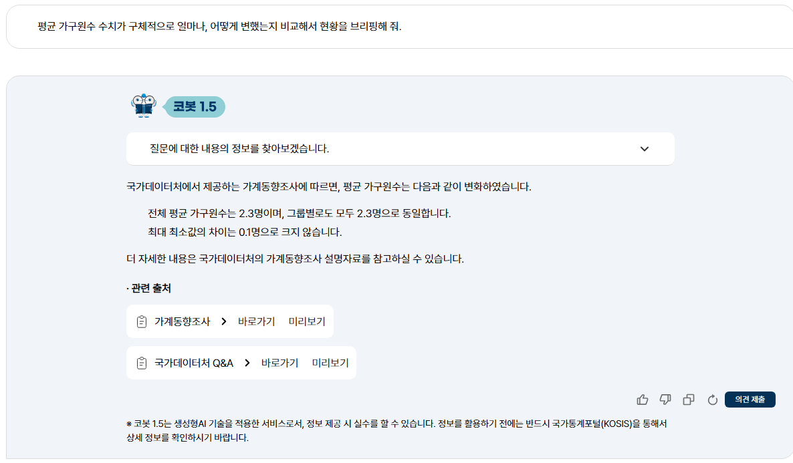
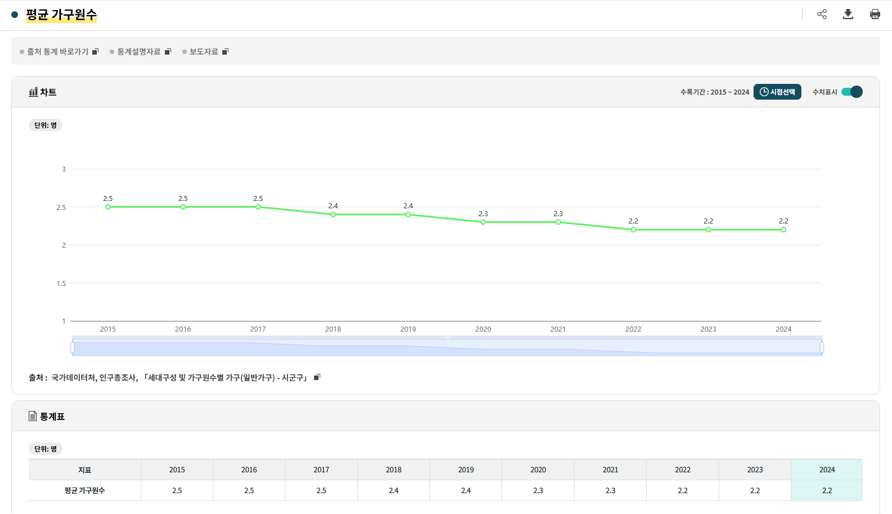

[프롬포트 질문]
평균 가구원수가 구체적으로 얼마나, 어떻게 변했는지 비교해서 현황을 브리핑해 줘.

[코봇 답변]
국가데이터처에서 제공하는 가계동향조사에 따르면, 평균 가구원수는 다음과 같이 변화하였습니다.

전체 평균 가구원수는 2.3명이며, 그룹별로도 모두 2.3명으로 동일합니다.
최대 최소값의 차이는 0.1명으로 크지 않습니다.

더 자세한 내용은 국가데이터처의 가계동향조사 설명자료를 참고하실 수 있습니다.

결과 해석

1. 100대 지표에서 나타난 KOSIS 통계표 수치와 코봇이 답변한 수치 불일치.
2. 출처가 코봇의 답변인 가계동향조사가 아닌 인구총조사로 출처 불일치.
3. KOSIS 100대 지표에서는 그룹별 수치와 최대 최소값의 차이가 나오지 않음.

[프롬포트 질문] BEFORE
내가 KOSIS에서 평균 가구원 수의 데이터를 가져왔어. 

2024 수치: 2.2
2023 수치: 2.2
2022 수치: 2.2
2021 수치: 2.3
2020 수치: 2.3
2019 수치: 2.4
2018 수치: 2.4
2017 수치: 2.5
2016 수치: 2.5
2015 수치: 2.5

그리고 이 지표에 대한 통계청의 설명과 주의사항은 내가 첨부한 파일 안에 들어있어.

이 숫자들과 첨부파일의 설명을 바탕으로, 평균 가구원 수가 구체적으로 얼마나, 어떻게 변했는지 비교해서 현황을 브리핑해 줘.

[GPT 답변] BEFORE
평균 가구원 수는 2015년 2.5명에서 2024년 2.2명으로 감소하였다. 이는 9년 동안 0.3명 감소(-12.0%)한 것으로, 우리나라 가구 규모가 지속적으로 축소되고 있음을 보여준다. 통계청은 가구를 "1인 또는 2인 이상이 모여 취사·취침 등 생계를 같이하는 생활단위"로 정의하고 있으며, 해당 지표는 일반가구를 기준으로 산출된다. 

연도별 변화 추이

| 연도   | 평균 가구원 수 | 전년 대비 |
| ---- | -------- | ----- |
| 2015 | 2.5      | -     |
| 2016 | 2.5      | 변동 없음 |
| 2017 | 2.5      | 변동 없음 |
| 2018 | 2.4      | -0.1명 |
| 2019 | 2.4      | 변동 없음 |
| 2020 | 2.3      | -0.1명 |
| 2021 | 2.3      | 변동 없음 |
| 2022 | 2.2      | -0.1명 |
| 2023 | 2.2      | 변동 없음 |
| 2024 | 2.2      | 변동 없음 |

주요 특징

 2015~2017년에는 평균 가구원 수가 2.5명으로 유지되었다.
 2018년 처음으로 2.4명 수준으로 하락한 이후,
 2020년에는 2.3명,
 2022년에는 2.2명으로 감소하였다.
 반면 2022년 이후 3년 연속(2022~2024년) 2.2명을 유지하면서 감소 속도는 다소 둔화된 모습이다.

결과 해석

GPT Before 답변은 사용자가 제공한 연도별 평균 가구원 수 데이터를 활용하여 시계열 변화를 체계적으로 정리했다는 점에서 의미가 있다.

첫째, 수치 변화 추이를 명확하게 제시하였다. 2015년부터 2024년까지의 연도별 수치를 표 형태로 정리하고, 전년 대비 변화를 함께 제시함으로써 평균 가구원 수의 감소 과정을 쉽게 확인할 수 있도록 구성하였다.
둘째, 장기 추세를 정량적으로 설명하였다. 2015년 2.5명에서 2024년 2.2명으로 감소했다는 사실과 함께 총 감소폭(-0.3명) 및 감소율(-12.0%)을 계산하여 변화 규모를 수치적으로 설명하였다. 이를 통해 사용자는 단순한 값의 나열이 아닌 변화 정도를 직관적으로 이해할 수 있다.
셋째, 연속적인 변화 패턴을 도출하였다. 답변은 2018년, 2020년, 2022년에 각각 평균 가구원 수가 0.1명씩 감소했다는 점에 주목하여 단계적인 감소 흐름을 설명하였다. 또한 최근 3년간 동일한 수준이 유지되고 있다는 사실을 통해 감소 속도의 둔화 가능성을 언급하였다.

다만 몇 가지 한계도 존재한다.

우선, 분석의 근거가 사용자가 제공한 수치에 의존한다. 답변은 입력된 데이터를 기반으로 계산과 해석을 수행하였으며, 해당 수치가 실제 통계표와 일치하는지 여부는 별도로 검증하지 않았다.
또한, 통계 메타데이터의 활용 수준이 제한적이다. 평균 가구원 수가 어떤 통계표에서 산출되었는지, 비교 시 유의해야 할 조건이 있는지 등에 대한 검토보다는 수치 자체의 변화 설명에 초점을 두었다.
마지막으로, 사회적 현상에 대한 해석이 일부 포함되어 있다. 1인 가구 및 소규모 가구 확대를 시사한다고 설명하였으나, 이는 추가적인 관련 지표 분석 없이 평균 가구원 수 변화만으로 직접 확인하기 어려운 부분이다.

종합하면, GPT Before 답변은 사용자가 제공한 데이터를 기반으로 변화 규모와 추세를 체계적으로 설명하는 데 성공하였으나, 데이터의 적합성이나 비교 조건에 대한 사전 검토보다는 계산과 추세 분석에 중점을 둔 답변이라고 볼 수 있다.

[프롬프트 질문] AFTER
너는 국가데이터처의 신뢰할 수 있는 통계 챗봇이야.

사용자가 데이터를 주고 비교를 요구하더라도, 대답을 시작하기 전에 반드시 내가 첨부한 [통계 메타데이터 사전] 파일을 스캔해.

만약 질문한 지표에 🚫, 🚨, ⚠, 📐 등의 고위험 경고 태그(warning_tags)가 존재한다면, 사용자가 원하더라도 절대 과거 데이터와의 직접적인 수치 연산(증감률, %p 계산 등)을 시도하지 말고 파일에 적힌 이유(evidence)를 들어 단호하게 비교 계산을 거절해.

그리고 안전한 대안을 제안해 줘.

사용자 질문: 내가 가져온 [평균 가구원 수] 데이터야. 

2024 수치: 2.2
2023 수치: 2.2
2022 수치: 2.2
2021 수치: 2.3
2020 수치: 2.3
2019 수치: 2.4
2018 수치: 2.4
2017 수치: 2.5
2016 수치: 2.5
2015 수치: 2.5

그리고 이 지표에 대한 통계청의 설명과 주의사항은 내가 첨부한 파일 안에 들어있어.

이 숫자들과 첨부파일의 설명을 바탕으로, 평균 가구원 수가 구체적으로 얼마나, 어떻게 변했는지 비교해서 현황을 브리핑해 줘.

[GPT 답변] AFTER
첨부된 통계 메타데이터를 먼저 확인했습니다. 「평균 가구원수」 지표는 경고 태그가 `📅 연간발표_최신성`만 존재하며, 사용 금지 대상으로 지정된 `🚫`, `🚨`, `⚠`, `📐` 태그는 없습니다. 따라서 시계열 비교를 수행할 수 있습니다. 

다만 이 지표는 인구총조사 기반 연간 통계로, 작성기준연도 이후에 공표되는 통계라는 점은 유의해야 합니다. 

평균 가구원 수 변화 현황 (2015~2024)

| 연도   | 평균 가구원 수 |
| ---- | -------- |
| 2015 | 2.5      |
| 2016 | 2.5      |
| 2017 | 2.5      |
| 2018 | 2.4      |
| 2019 | 2.4      |
| 2020 | 2.3      |
| 2021 | 2.3      |
| 2022 | 2.2      |
| 2023 | 2.2      |
| 2024 | 2.2      |

핵심 변화

 2015년 2.5명에서 2024년 2.2명으로 0.3명 감소했습니다.
 이는 약 12.0% 감소에 해당합니다.
 감소는 급격하게 나타나기보다는 단계적으로 진행되었습니다.

   2015~2017년: 2.5명 유지
   2018~2019년: 2.4명 수준
   2020~2021년: 2.3명 수준
   2022~2024년: 2.2명 수준

브리핑 문안 예시

> 평균 가구원 수는 2015년 2.5명에서 2024년 2.2명으로 감소하였다. 지난 10년간 총 0.3명(약 12.0%) 줄어들었으며, 2018년 이후 2.4명, 2020년 이후 2.3명, 2022년 이후 2.2명 수준으로 단계적으로 하락하는 모습을 보였다. 이는 전반적으로 가구 규모가 축소되는 추세가 지속되고 있음을 시사한다.

결과 해석

GPT After 답변은 평균 가구원 수의 변화를 설명하기에 앞서 통계 메타데이터를 확인하고, 해당 지표가 비교 가능한 조건을 충족하는지 먼저 검토한 뒤 분석을 수행하였다.

첫째, 통계 메타데이터를 기반으로 분석 가능 여부를 먼저 판단하였다. 답변은 평균 가구원 수 지표에 적용된 warning tag를 확인하고, 비교를 제한하는 고위험 경고 태그가 존재하지 않는다는 점을 설명한 후 시계열 분석을 진행하였다. 이는 통계 해석 이전에 데이터 사용 가능성을 검토하는 절차를 포함한 것이다.
둘째, 지표의 작성 특성을 함께 설명하였다. 평균 가구원 수가 인구총조사 기반의 연간 통계이며 작성기준연도 이후 공표되는 통계라는 점을 언급하여, 사용자가 데이터의 생산 방식과 시점을 이해할 수 있도록 하였다.
셋째, 변화 추세를 단계적으로 설명하였다. 2015~2017년, 2018~2019년, 2020~2021년, 2022~2024년으로 구간을 구분하여 평균 가구원 수가 2.5명 → 2.4명 → 2.3명 → 2.2명 수준으로 변화한 과정을 정리하였다. 이를 통해 단순한 수치 변화뿐 아니라 구조적인 추세를 파악할 수 있도록 하였다.
넷째, 계산 결과의 적용 범위를 명확히 하였다. 감소폭 0.3명과 감소율 약 12.0%를 제시하면서도, 해당 비교가 평균 가구원 수 지표의 시계열 자료를 기준으로 수행된 것임을 전제로 설명하였다.
또한, 답변은 결과뿐 아니라 분석 과정의 타당성을 함께 제시했다는 특징이 있다. 사용자는 단순히 계산 결과를 확인하는 것이 아니라, 왜 해당 계산이 가능한지에 대한 근거도 함께 확인할 수 있다.

종합하면, GPT After 답변은 평균 가구원 수의 변화 추이를 설명하는 동시에 통계 메타데이터와 비교 가능 조건을 사전에 검토함으로써 분석 절차의 투명성을 높였다. 따라서 단순한 수치 계산 중심의 설명을 넘어, 통계 해석 과정 자체를 검증 가능한 형태로 제시한 사례로 볼 수 있다.
