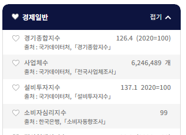
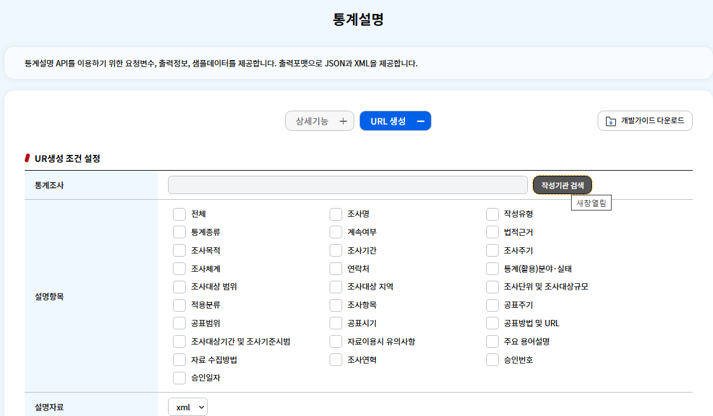
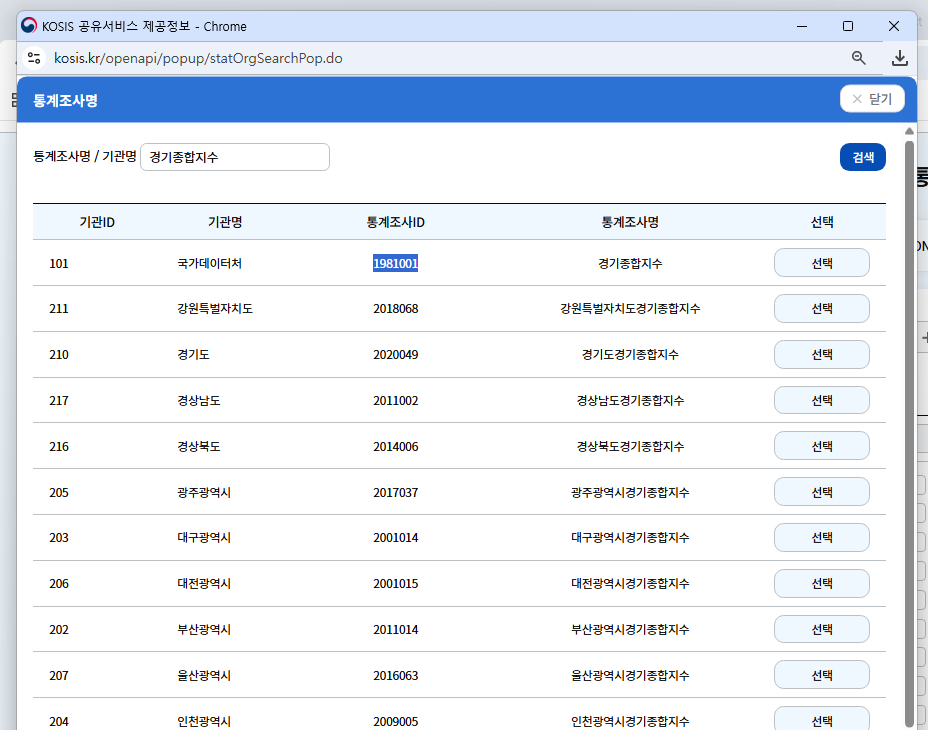
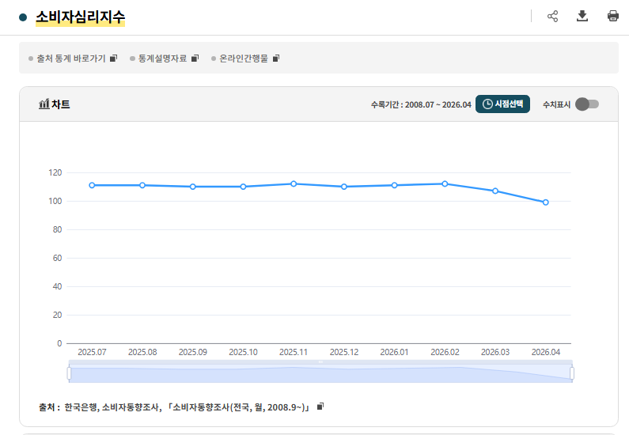
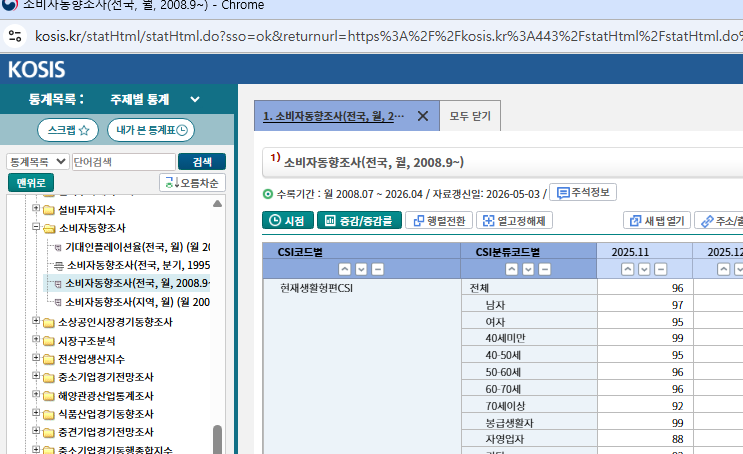
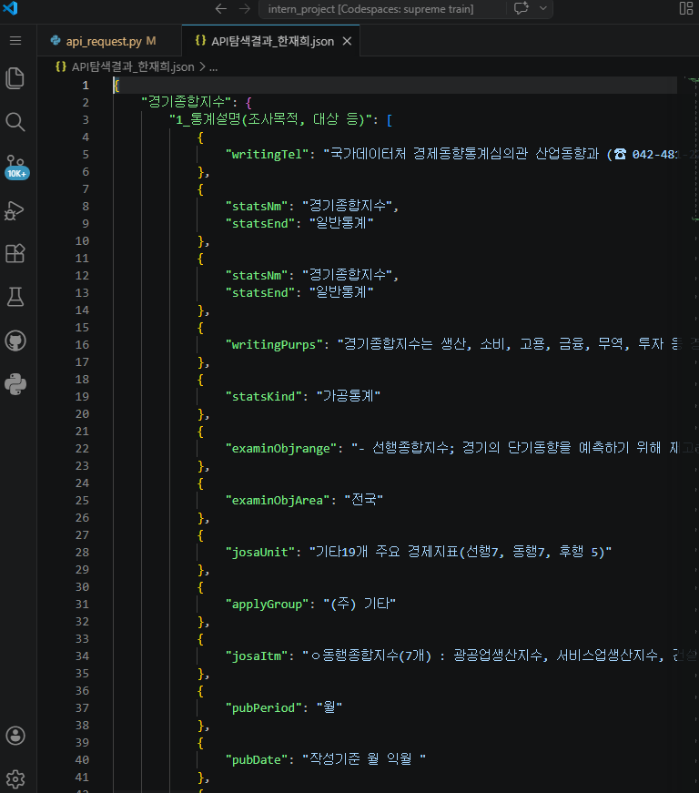

## 코드 로드맵

**🟩 Step 1: 통계표 '뼈대(메뉴판)' 자동 수집**

* **목표:** KOSIS API를 파이썬 코드로 호출하여, 각 지표가 속한 거대한 통계표(`tblId`)의 전체 구조와 세부 항목(ITM) 리스트를 싹 다 긁어옵니다.

* **파이썬 코드**\
  이 코드에 각자 분담한 분야에 맞게 수정이 필요합니당!!

**복붙할 코드(파이썬 버전)**

```python
import requests
import json
import re

# ==========================================
# [설정] 팀원 각자 자신의 정보로 수정해서 사용하세요!
# ==========================================
# KOSIS OpenAPI 포털에서 발급받은 본인의 인증키를 입력하세요.
API_KEY = "여기에_본인의_API_키를_입력하세요" 

# 1. 내 이름 입력 (결과 파일명에 사용됨)
TEAM_MEMBER = "이름입력" # 함승은, 김민송, 백선아, 임다원, 한재희 형식으로 쓰면 좋을거 같아요

# 2. 내가 맡은 지표들의 ID 목록
# 본인이 할당받은 지표들을 아래 양식에 맞춰 리스트에 추가해 주세요.
# - tblId나 orgId를 아직 못 찾았다면 빈칸("")으로 두면 알아서 스킵됩니다.
MY_INDICATORS = [
    # ⬇️ 작성 예시 (참고 후 지우고 본인 지표로 채우세요!)
    # {"number": 번호, "category": "카테고리명", "name": "지표명", "orgId": "기관코드", "statId": "조사ID", "tblId": "통계표ID"},
    
    {"number": 1, "category": "사회", "name": "테스트지표1", "orgId": "101", "statId": "1234567", "tblId": "DT_TEST01"},
    {"number": 2, "category": "환경", "name": "테스트지표2", "orgId": "101", "statId": "7654321", "tblId": ""} 
]

# ==========================================
# 함수 정의 (API 찌르기 및 KOSIS 버그 수정)
# ==========================================
def fetch_kosis_data(url, params):
    response = requests.get(url, params=params)
    try:
        return response.json()
    except json.JSONDecodeError:
        # KOSIS 특유의 따옴표 누락 버그 보정
        fixed_text = re.sub(r'([a-zA-Z0-9_]+):', r'"\1":', response.text)
        try:
            return json.loads(fixed_text)
        except:
            return "데이터가 없거나 파싱 불가"

# ==========================================
# 데이터 탐색 및 수집 실행
# ==========================================
print(f"🚀 {TEAM_MEMBER}님의 지표 API 탐색을 시작합니다...\n")

exploration_results = {}

for ind in MY_INDICATORS:
    # tblId나 orgId가 비어있으면 건너뛰기
    if not ind['tblId'] or not ind['orgId']:
        print(f"⚠️ [{ind['name']}] ID 정보가 부족하여 건너뜁니다.")
        continue

    print(f"[{ind['name']}] 데이터 수집 중...")
    
    ind_data = {}
    
    # 1. 통계설명 API (전체 항목 ALL) - '공장' 정보 가져오기
    url_expl = "https://kosis.kr/openapi/statisticsExplData.do"
    params_expl = {
        "method": "getList", "apiKey": API_KEY, "format": "json", "jsonVD": "Y",
        "statId": ind['statId'], "metaItm": "ALL"
    }
    ind_data["1_통계설명(조사목적, 대상 등)"] = fetch_kosis_data(url_expl, params_expl)
    
    # 2. 메타자료 API (항목/분류 정보) - '제품' 정보 가져오기
    url_meta = "https://kosis.kr/openapi/statisticsData.do"
    params_meta_itm = {
        "method": "getMeta", "apiKey": API_KEY, "format": "json", "jsonVD": "Y",
        "orgId": ind['orgId'], "tblId": ind['tblId'], "type": "ITM"
    }
    ind_data["2_메타자료_항목및분류(ITM)"] = fetch_kosis_data(url_meta, params_meta_itm)
    
    # 3. 메타자료 API (단위 정보) - '제품' 단위 가져오기
    params_meta_unit = {
        "method": "getMeta", "apiKey": API_KEY, "format": "json", "jsonVD": "Y",
        "orgId": ind['orgId'], "tblId": ind['tblId'], "type": "UNIT"
    }
    ind_data["3_메타자료_단위(UNIT)"] = fetch_kosis_data(url_meta, params_meta_unit)

    # 지표별로 결과 저장
    exploration_results[ind['name']] = ind_data

# ==========================================
# 결과 파일 저장
# ==========================================
filename = f"API탐색결과_{TEAM_MEMBER}.json"
with open(filename, "w", encoding="utf-8") as f:
    json.dump(exploration_results, f, indent=4, ensure_ascii=False)

print(f"\n✅ 탐색 완료! [{filename}] 파일을 열어서 어떤 데이터가 들어있는지 확인해보세요.")
```

동일 코드 제미나이 써서 R 버전으로 바꿔봤습니다

```R
# ==========================================
# 0. 필요 패키지 로드 
# (설치되어 있지 않다면 아래 주석을 해제하고 먼저 실행하세요)
# ==========================================
# install.packages(c("httr", "jsonlite", "stringr"))
library(httr)
library(jsonlite)
library(stringr)

# ==========================================
# [설정] 팀원 각자 자신의 정보로 수정해서 사용하세요!
# ==========================================
# KOSIS OpenAPI 포털에서 발급받은 본인의 인증키를 입력하세요.
API_KEY <- "여기에_본인의_API_키를_입력하세요" 

# 1. 내 이름 입력 (결과 파일명에 사용됨)
TEAM_MEMBER <- "이름입력" # 함승은, 김민송, 백선아, 임다원, 한재희 형식으로 쓰면 좋을거 같아요

# 2. 내가 맡은 지표들의 ID 목록 (R의 list 구조 활용)
# 🚨 [주의] 할당받은 모든 지표의 빈칸(ID)을 끝까지 추적해서 100% 채워 넣어야만 코드가 실행됩니다!
MY_INDICATORS <- list(
  # ⬇️ 작성 예시 (참고 후 지우고 본인 지표로 모두 채우세요!)
  list(number = 1, category = "사회", name = "테스트지표1", orgId = "101", statId = "1234567", tblId = "DT_TEST01"),
  list(number = 2, category = "환경", name = "테스트지표2", orgId = "101", statId = "7654321", tblId = "DT_TEST02")
)

# ==========================================
# 함수 정의 (API 찌르기 및 KOSIS 버그 수정)
# ==========================================
fetch_kosis_data <- function(url, params) {
  res <- GET(url, query = params)
  res_text <- content(res, as = "text", encoding = "UTF-8")
  
  # R의 tryCatch를 이용한 파싱 및 정규식 에러 핸들링
  parsed_data <- tryCatch({
    fromJSON(res_text)
  }, error = function(e) {
    # KOSIS 특유의 따옴표 누락 버그 보정
    fixed_text <- str_replace_all(res_text, "([a-zA-Z0-9_]+):", "\"\\1\":")
    tryCatch({
      fromJSON(fixed_text)
    }, error = function(e2) {
      return("데이터가 없거나 파싱 불가")
    })
  })
  
  return(parsed_data)
}

# ==========================================
# 데이터 탐색 및 수집 실행
# ==========================================
cat(sprintf("🚀 %s님의 지표 API 탐색을 시작합니다...\n\n", TEAM_MEMBER))

exploration_results <- list()

for (ind in MY_INDICATORS) {
  
  # 🚨 필수 값 누락 체크 (무조건 다 채워야 돌아가도록 강제 종료)
  if (is.null(ind$tblId) || str_trim(ind$tblId) == "" ||
      is.null(ind$orgId) || str_trim(ind$orgId) == "" ||
      is.null(ind$statId) || str_trim(ind$statId) == "") {
    
    cat(sprintf("❌ [작업 중단] '%s' 지표의 ID 값이 비어있습니다!\n", ind$name))
    cat("💡 타협은 없습니다. KOSIS 포털을 샅샅이 뒤져서 모든 빈칸을 100% 채운 뒤 다시 실행해주세요.\n")
    stop("스크립트 실행을 중단합니다.")
  }
  
  cat(sprintf("[%s] 데이터 수집 중...\n", ind$name))
  
  ind_data <- list()
  
  # 1. 통계설명 API (전체 항목 ALL) - '공장' 정보 가져오기
  url_expl <- "https://kosis.kr/openapi/statisticsExplData.do"
  params_expl <- list(
    method = "getList", apiKey = API_KEY, format = "json", jsonVD = "Y",
    statId = ind$statId, metaItm = "ALL"
  )
  ind_data[["1_통계설명(조사목적, 대상 등)"]] <- fetch_kosis_data(url_expl, params_expl)
  
  # 2. 메타자료 API (항목/분류 정보) - '제품' 정보 가져오기
  url_meta <- "https://kosis.kr/openapi/statisticsData.do"
  params_meta_itm <- list(
    method = "getMeta", apiKey = API_KEY, format = "json", jsonVD = "Y",
    orgId = ind$orgId, tblId = ind$tblId, type = "ITM"
  )
  ind_data[["2_메타자료_항목및분류(ITM)"]] <- fetch_kosis_data(url_meta, params_meta_itm)
  
  # 3. 메타자료 API (단위 정보) - '제품' 단위 가져오기
  params_meta_unit <- list(
    method = "getMeta", apiKey = API_KEY, format = "json", jsonVD = "Y",
    orgId = ind$orgId, tblId = ind$tblId, type = "UNIT"
  )
  ind_data[["3_메타자료_단위(UNIT)"]] <- fetch_kosis_data(url_meta, params_meta_unit)
  
  # 지표별로 결과 저장
  exploration_results[[ind$name]] <- ind_data
}

# ==========================================
# 결과 파일 저장
# ==========================================
filename <- sprintf("API탐색결과_%s.json", TEAM_MEMBER)

# R에서 JSON 저장 시 Python의 json.dump와 동일한 형태(auto_unbox=TRUE)로 출력되게 맞춤
write_json(exploration_results, path = filename, pretty = TRUE, auto_unbox = TRUE)

cat(sprintf("\n✅ 100%% 탐색 완료! 완벽합니다. [%s] 파일을 열어서 진짜 항목 코드(itmId)를 골라내 봅시다.\n", filename))
```

* **작업 내용:** `MY_INDICATORS` 리스트에 `orgId`, `statId`, `tblId`를 채워 넣고 파이썬 스크립트를 실행합니다.

내용을 채우는 기준은 **KOSIS 100대 지표 사이트의 지표 목록**





1. 출처에 기입된 「조사명」을 KOSIS 공유서비스 > 개발가이드 > **통계설명 >&#x20;**&#xC791;성기관 검&#xC0C9;**&#x20;>&#x20;**&#xC5D0; 검색해서 `statId` 채우기\
   이 때 같이 결과에 나오는 기관 코드 번호를 `orgId`에 기입 **(출처에 나타나는 기관과 동일한 기관인지 확인하기!) - 여러개가 출력되는 경우 최신 자료로 통일**



지표 상세 내용 보기로 들어가면 다양한 시각화 그래프가 나오는데 여기서 밑에 보이는 **출처 통계표** 클릭하기!



그러면 시각화를 위해 활용되는 데이터 통계표가 나타나는데\
2. 이 통계표의 제목을 KOSIS 공유서비스 > 개발가이드 > **통계자료**에 검색해서 `tblId` 채우&#xAE30;**&#x20;(여기서도 동일하게** **출처에 나타나는 기관과 동일한 기관인지 확인하기!) - 동일한 자료 여러개 나오면 최신 자료 선택하기**

**🏭 통계조사 ➡️ 통계표 ➡️ 세부항목의 3단계 필터링 구조**

우리가 목표로 하는 단 하나의 숫자(예: 경제성장률 3.6%)를 AI에게 정확히 먹여주기 위해서는 다음의 깔끔한 하향식(Top-Down) 필터링 단계를 거치게 됩니다.

**1단계: 🏭 `statId` (통계조사) - "어떤 공장에서 만들어졌나?"**

* **역할:** 데이터의 **신뢰성과 배경(Context) 검증**

* **설명:** 이 수치가 어떤 법적 근거로, 누구를 대상으로, 어떻게 조사되었는지 AI에게 '출처와 맥락'을 알려줍니다. 수치값 자체는 없지만, 환각을 막는 방패 역할을 합니다.

* *(예: 한국은행의 '국민계정' 조사에서 나왔어.)*

**2단계: 📦 `tblId` (통계표) - "공장에서 나온 박스(표) 통째로 가져오기"**

* **역할:** 데이터의 **물리적 뼈대(Structure) 확보**

* **설명:** 타겟 지표뿐만 아니라, 그와 관련된 수십 개의 조연 지표들이 모두 포함된 거대한 매트릭스(Matrix)를 호출합니다. 아직 타겟팅이 안 된 상태입니다.

* *(예: '주요분기지표'라는 박스를 가져왔어. 이 안에는 명목 GDP, 실질 GDP, 수출입, 경제성장률 등이 다 섞여 있어.)*

**3단계: 🎯 `itmId` (세부 항목) - "박스 안에서 우리가 원하는 진짜 알맹이 꺼내기" [핵심 필터링!]**

* **역할:** 데이터의 **타겟팅(Targeting)**

* **설명:** `tblId`로 가져온 거대한 표 안에서 우리가 '진짜 쳐다볼 단 하나의 행(Row) 또는 열(Column)'을 수동으로 핀셋처럼 집어내는 단계입니다. 이 값이 있어야만 AI가 엉뚱한 숫자를 읽지 않습니다.

* *(예: 아까 가져온 박스에서 다른 건 다 무시하고, `itmId`가 `T10`인 '경제성장률' 줄만 읽어!)*

**(선택) 4단계: 🏷️ `objId` (분류 코드) - "세부 조건 걸기"**

* **역할:** **교차 필터링 (Cross-Filtering)**

* **설명:** 만약 '사업체수'처럼 지역별/산업별로 쪼개지는 표라면, "전국(`00`) + 전체산업(`0`)"이라는 조건을 추가로 걸어주어야 단일 수치로 딱 떨어집니다.

- **결과물:** `API탐색결과_@@@.json` (우리가 요리할 재료가 다 모인 거대한 메뉴판)

**결과물 예시**


[API탐색결과_한재희.json](/page/files/283537e08d8c440d9aabc7f563621f05/API탐색결과_한재희.json)

**🟨 Step 2: 핵심 알맹이(`itmId`) 추출 및 XAI 온톨로지 설계**

* **목표:** AI가 방대한 표 안에서 헤매지 않고 정확한 지표만 쏙 빼오도록 타겟을 지정하고, 그 숫자가 정책적으로 어떤 의미인지 '인간의 설명'을 주입합니다.

* **작업 내용 (수동 - 이걸 어떤 내용을 할지 조금씩 고민해보고 다음 회의까지 생각해서 서로 의견을 나누면 좋을 것 같습니다):**

  1. **타겟팅:** 탐색결과 JSON을 열어서, 수많은 항목 중 우리가 진짜 필요로 하는 열의 고유 코드(`itmId`)를 찾아냅니다. *(예: 사업체수 표에서 진짜 '사업체수' 열의 코드는 `T1`이다.)*

  2. **도메인 지식 주입:** e-나라지표나 공식 보도자료를 참고하여, 이 지표의 **정의, 단위, 산출식, 그리고 해석 시 주의사항**을 텍스트로 정리합니다.

  3. **XAI 가이드라인:** 단순한 사전적 의미를 넘어, *"*&#xC815;책 의사결정자가 A를 물어보면 절대 수치를 답하고, B를 물어보면 증감률을 강조해서 데이터 스토리텔링을 해&#xB77C;*"* 같은 명확한 지침을 씁니다.

  4. 등등등.. 추가적으로 들어가면 좋을 내용을 생각해봐도 좋을거 같아요

�&#xDFE6;**&#x20;Step 3: 최종 AI 메타데이터 정답지(JSON) 조립**

* **목표:** Step 2에서 사람이 고민한 결과를, AI 모델(LLM)이 즉시 읽고 이해할 수 있는 하나의 규격화 된 파일로 합칩니다.

* **작업 내용:** 팀원들이 각자 맡은 지표들에 대해 아래와 같은 구조의 최종 매핑 파일을 작성합니다.

**예시 최종 매핑 파일**

```text
{
"지표명": "사업체수",
"API_호출경로": {
"orgId": "101",
"tblId": "DT_1K52F01",
"itmId": "T1"
},
"XAI_지식": {
"정의": "일정한 물리적 장소에서 경제활동을 하는 단일 경영단위의 수",
"AI_답변지침": "지역별 경제 활성도를 묻는 질문에는 시도별 분류 코드를 연결해 답변하고, 특정 산업의 규모를 묻는다면 산업별 분류 코드를 기준으로 설명해라."\
}
}
```

�&#xDFEA;**&#x20;Step 4: 프롬프팅 테스트 및 정책 효용성 검증**

* **목표:** 완성된 정답지를 실제 AI에 물려보고, 우리가 의도한 대로 똑똑하게 대답하는지 검증합니다.

* **작업 내용:**

  * 질문 던지기: *"현재 우리나라 경제성장률과 그 원인을 설명해 줘."*

**🤖 "2025년 사업체수는 얼마야?" 질문 시 AI의 작동 원리**

1. 질문 의도 파악 및 정답지 검색

* **사용자:** "2025년 사업체수는 얼마야?"

* **AI 모델:** 사용자의 질문에서 '사업체수'와 '2025년'이라는 키워드를 인식합니다. 그리고 재희 님과 팀원들이 정성껏 만들어둔 `AI_Metadata_Master.json`(최종 매핑 정답지)을 뒤져서 '사업체수' 항목을 찾습니다.

2. KOSIS 심부름꾼(API)에게 정확한 주문서 작성

* **AI 모델:** 정답지를 읽어보니 이렇게 적혀 있네!

  * `tblId` (어떤 표에서?): `DT_1K52F01`

  * `itmId` (무슨 항목을?): `T1` (사업체수)

  * `objId` (어떤 조건으로?): `00`(전국), `0`(전체산업)

* **AI 모델:** "아하! 그럼 2025년(기간) 데이터를 가져오기 위해 **KOSIS 통계자료조회(getStatsData) API**를 찔러야겠다."

3. 진짜 데이터(수치) 실시간 호출 (Function Calling)

* 이때 시스템은 우리가 앞서 수집했던 메타자료 API가 아니라, **실제 수치를 가져오는 전용 API**를 백그라운드에서 실시간으로 호출합니다.

* **[시스템이 KOSIS로 보내는 실제 요청]** `"tblId=DT_1K52F01 & itmId=T1 & objL1=00 & objL2=0 & prdSe=Y & prdLsn=2025"`

* **[KOSIS의 응답]** `[{"DTVAL_CO": "6100000"}]` (진짜 숫자 반환!)

4. 데이터 스토리텔링을 곁들인 최종 답변 생성

* 진짜 숫자(610만 개)를 받아든 AI는 다시 우리의 정답지(온톨로지)에 적힌 '답변 지침'을 봅니다.

* **AI 모델의 최종 대답:** "2025년 기준 우리나라의 총 사업체 수는 약 610만 개입니다. 이 수치는 개인 사업체와 법인을 모두 포함한 단일 경영단위의 수를 의미하며..."

* AI가 `DT_200Y015` 표에서 GDP(절대치)가 아닌 성장률(%) 항목을 정확히 가져왔는지, 그리고 내수와 수출 지표를 엮어서 제대로 된 '정책적 인사이트'를 내놓는지 확인합니다.

* 예측이나 단순 수치 나열에 그친다면, Step 2의 'AI_답변지침'을 수정하여 설명력을 더 끌어올립니다.
